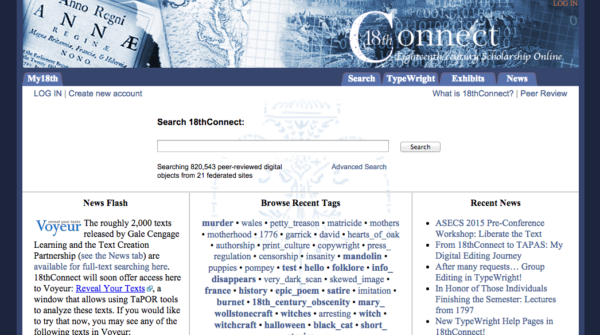
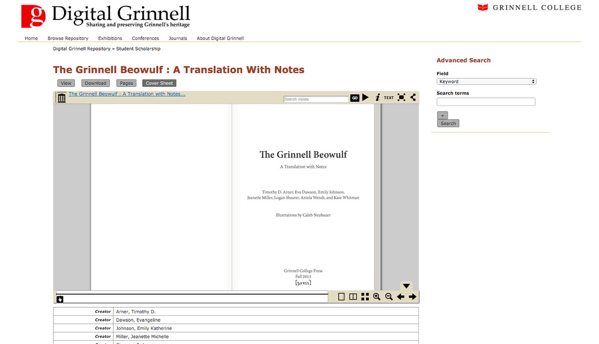
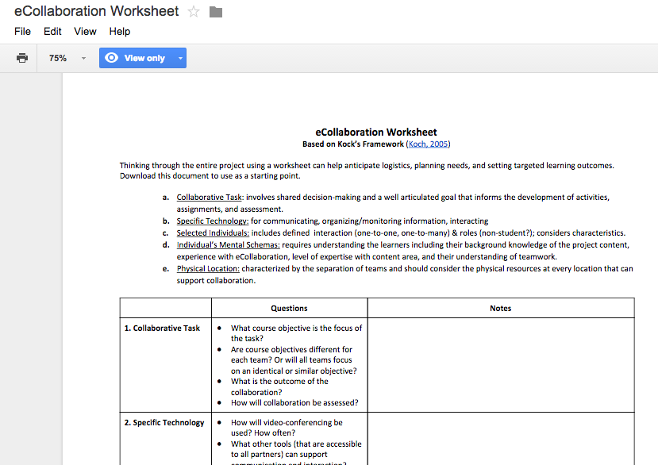
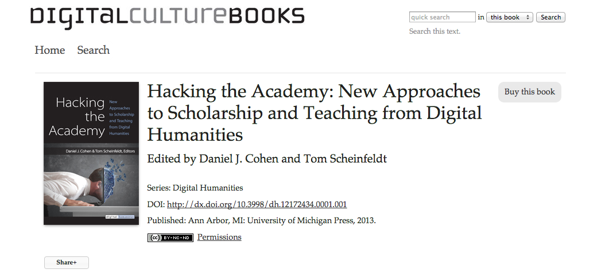
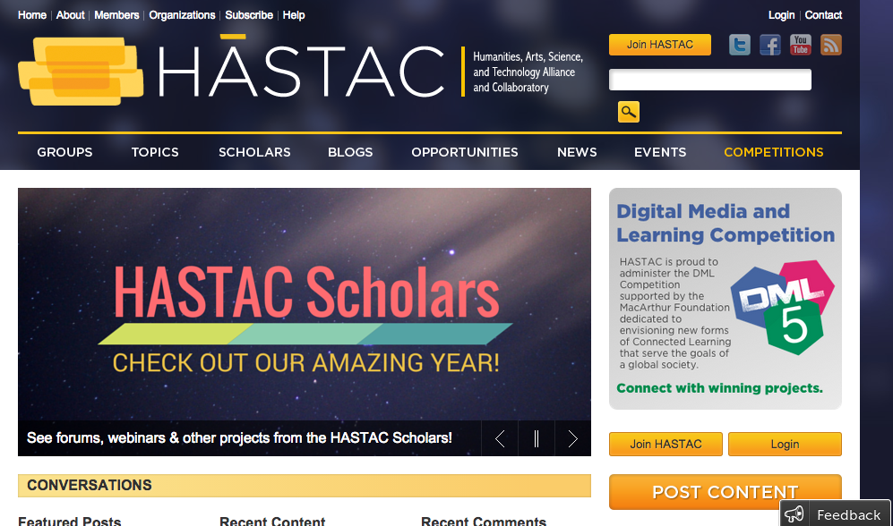
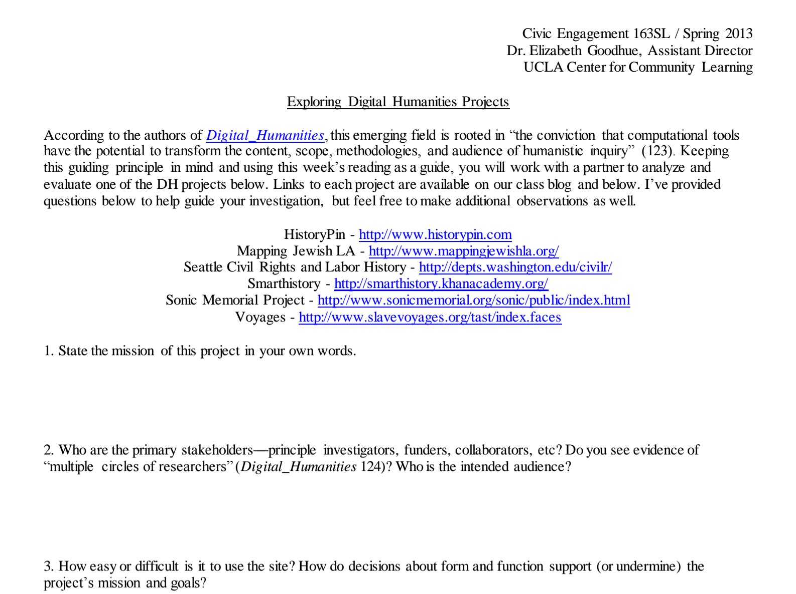
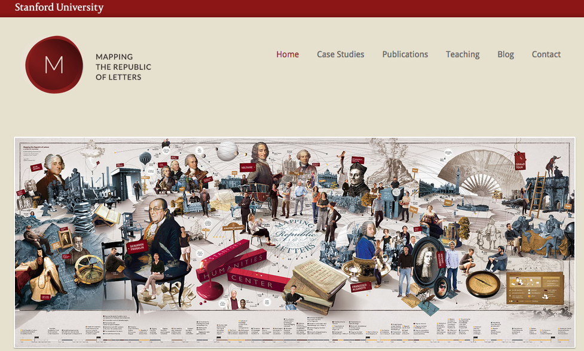

# Community (Draft)

## Bridget Draxler
Assistant Professor and Director of Communication Across the Curriculum, Monmouth University | http://www.monmouthcollege.edu/academics/faculty.aspx?id=0768977

---

##### Publication Status:

* **unreviewed draft**
* draft version undergoing editorial review
* draft version undergoing peer-to-peer review
* published

--- 
 
## CURATORIAL STATEMENT (roughly 750-800 words, MLA Format)

Community is a term that has suffered from its own niceness. In *Keywords for American Cultural Studies*, Miranda Joseph points out the problems with a term like “community”--a term that is too easily used without critical consideration. She frames the term at best as “nearly meaningless” in its overuse and at worst as a tool of manipulative persuasion in its empty signification of “a sense of belonging, understanding, caring, cooperation, equality.” 
 
When I introduce my undergraduate students to work like Joseph’s, they retaliate. They love to question and interrogate social norms and assumptions, but they are deeply uncomfortable with pushing back on the inherent goodness of concepts like community. And part of me can’t help but admire their well-articulated resistance, their commitment to identifying shared investment with those around them. While there is value in critical questions like Joseph’s, there is also something worth celebrating in the reverence that “community” inspires. 

As a humanities teacher, I want to give my students both the critical lens to identify the limitations, exclusions, and misapplications of “community” but also a sense of hope and commitment to others, whether in our classroom community, the broader local community, or the communities in which they will find themselves living and working in the future. I want to equip them to be critical yet committed citizens, aware of the potential for communities to either separate insiders from outsiders, or to find common ground between them. 

Digital spaces exacerbate this tension in the academy’s relationship to a term like “community.”  Digital tools can seem to undermine traditional notions of community, highlighting the term’s meaninglessness through the apparent detachment of virtual engagement.  The idea of “digital community” can seem like an oxymoron, with the fluidity, expansiveness, and disembodiment of online groups. But if digital tools are changing and questioning our understanding of what constitutes community, they are also giving us new ways of engaging with community, and new communities to engage with. 

The idea of community, in a digital age, is perhaps defined less by shared space than by shared values. We are members of geographically defined communities, but we also find ourselves part of online communities defined by our goals, interests, affiliations and hobbies, whether through an actively conversational listserve or a crowdsourced database of information or a role-play virtual reality game. The notion that community is something to actively and intentionally create, rather than something you’re born into, gives participants deeper agency and investment--a quality that is not exclusive to virtual communities but is certainly championed by them. And, joining communities by choice online can make us rethink, for better or worse, the communities we find ourselves in by default. 

The best online communities are, in many ways, extensions or enhancements of analog communities, developing local communities in ways otherwise not possible. In the same vein, many of the most compelling digital humanities projects are rooted in the values and best practices of civic engagement: collaboration, openness, active learning, and reciprocity. Both the digital humanities and civic engagement share commitment to community, and some of the most exciting work in community building happens at the intersection of these somewhat strange bedfellows. 

The artifacts below highlight this link between digital humanities and civic engagement, featuring local communities connected in new ways using digital technologies. They also offer ways of reframing academic communities or reimagining the value of humanities research for and with a broader community, creating scholarship that is not only public [see Jeff McClurken’s entry on “Public” in this collection] but also collaborative, drawing on community expertise alongside academic research. They celebrate communities, even as they challenge communities to ask difficult questions about our relationships inside and between our communities. They illustrate how digital tools can bridge humanities research and public humanities through engagement with GLAM institutions (galleries, libraries, archives, and museums). Most importantly, they model ways that digital tools allow humanities research to be community-driven and community-generated, undermining the categories of teacher vs. student and expert vs. public. 

For the twenty-first-century humanist, the community is not our audience but our collaborator. If it is the role of the humanist to interrogate a term like community, it is also our deeper calling to fortify concepts like community that point to our shared humanity. The stories we tell and the questions we ask as humanists, especially digital humanists, can help us to find new reasons and ways to invest in our communities. 

## CURATED ARTIFACTS

### 18th Connect

* Source URL: http://www.18thconnect.org/
* Type: crowdsourced database
* Creator: Laura Mandell (Texas A&M)

18th Connect is a database of eighteenth-century texts driven by values of sharing and service. Along with features typical of online communities (discussions, groups) and scholarly communities (peer review, searchable archives), it offers scholars an opportunity to receive plain and TEI-encoded copies of texts from ProQuest and Gale in exchange for correcting any OCR errors in these texts. In addition to widening the circle of scholars and readers who have access to eighteenth-century texts, 18th Connect is also opening new opportunities for students to work with archival sources and create digital publications. For instance, Danielle Spratt’s graduate students at California State University - Northridge created a digital scholarly edition of Sarah Fielding’s The Countess of Dellwyn http://thecountessofdellwyn.weebly.com/, which simultaneously invited students to engage in collaborative research within the classroom community and to contribute to scholarly work within the online community. The collaboratively annotated text is accessible for undergraduate students to read, or could provide a model for students to create their own digital scholarly editions of texts. 

### Grinnell Beowulf

* Source URL: https://digital.grinnell.edu/islandora/object/grinnell:3615
* Type: student project
* Creator: Grinnell College Assistant Professor of English Tim Arner, and students Eva Dawson ’14, Emily Johnson ’14, Jeanette Miller ’14, Logan Shearer ’14, Aniela Wendt ’14, and Kate Whitman ’14 

Engaging students in the task of translating and annotating Beowulf for modern readers, Tim Arner (Grinnell College) created a for-students, by-students teaching edition of the early English text. The digital text offers an example of how public digital humanities projects can reframe students as teachers, democratizing not only access to but production of knowledge online. With even more multimedia elements, Digital Dubliners http://digitaldubliners.com/ (developed by students at Boston College) offers another example of students creating texts for other students--in this case, emphasizing the cultural context of Joyce’s Dublin. In this way, students develop a sense of community not only with their co-editors but also with imagined, future peer readers of these texts. 

### The Digital Studio for the Public Arts & Humanities
  

* Type: digital humanities center
* Source URL: http://thestudio.uiowa.edu/_wp/
* Creator: The University of Iowa

The Digital Studio for the Public Arts & Humanities is unique among digital humanities centers, by explicitly focusing on the intersection between digital humanities and civic engagement. The Studio has supported the development of several pedagogy-focused public digital humanities projects and events, including the City of Lit mobile app and the Rewiring the Classroom conference (http://thestudio.uiowa.edu/_wp/projects/). See especially the Passport Project http://thestudio.uiowa.edu/passport/, an innovative first-year course that asks students to blog about community events representing the arts, humanities, sciences, along with political events and performances in dance, theater, and music. Peer Mentors, recent graduates of the program, lead small group discussions. The course could be easily adapted to a variety of technological platforms and communities, and encourages students to identify, early on, not only as members of the campus community but also the broader local community. 

### eCollaboration Worksheet 
 

* Type: group assignment
* Source URL: https://docs.google.com/document/d/1J59ki10mKW4eLZoGpvrTbzkEnm0WPo236NdHap3rANk/edit
* Creator: Ned Kock, Texas A&M (author)

This helpful worksheet, developed by Ned Kock, helps students to make thoughtful decisions when beginning collaborative, digital projects. By asking our students to be intentional in these decisions, we help them to move beyond default uses of technology and default roles in a group project. Asking students to develop and sign group contracts or create a formal proposal justifying their choice of digital tools can also help teams to develop a sense of community and trust with one another. 

### Hacking the Academy
  

* Type: book
* Source URL: http://hackingtheacademy.org/ 
* Creator: Daniel J. Cohen and Tom Scheinfeldt (editors), University of Michigan Press

A book that was crowdsourced in the course of one week, Hacking the Academy is itself an innovative example of authoring in community. In addition, it offers resources and advice on digital pedagogy that, while beneficial for teachers, can be even more valuable when shared and discussed with students in a classroom community. In particular, I recommend Gideon Burton’s provocative “Dear Students,” which argues that the identities and communities we create online, rather than the classroom, are what matter most to students’ lives.  

### HASTAC
  

* Type: online community
* Source URL: http://www.hastac.org/
* Creator: Cathy Davidson and David Theo Goldberg (co-founders), Duke University and CUNY

HASTAC is an example of an online community it its best form, with a diverse and active readership. It has hosted some of the most exciting recent conversations about collaborations between educational institutions and GLAMs (galleries, libraries, archives and museums), partnerships that highlight the potential for reciprocity and student engagement in community-based digital humanities research and teaching. For more information on student involvement on HASTAC, see especially the HASTAC Scholars program, which has increasingly involved undergraduate student participants. 

NITLE (http://www.nitle.org/), which hosts Academic Commons (http://www.academiccommons.org/), is another online community with a deep interest in the intersection of the digital humanities, pedagogy, and civic engagement, with particular focus on liberal arts education. 

### Intro to Public Arts & Humanities
  

* Type: syllabus/lesson plans
* Source URL: 
* Creator: Beth Goodhue, UCLA

In Beth Goodhue’s Intro to Public Arts & Humanities course, undergraduate students spend a week discussing the intersection of community engagement and digital humanities. Students begin by reading Jeffrey Schnapp’s “A Short Guide to Digital Humanities” (https://mitpress.mit.edu/sites/default/files/titles/content/9780262018470_Open_Access_Edition.pdf),  emphasizing passages about how digital humanities redefines community and fosters a notion of “citizen scholars,” building on earlier readings like Gregory Jay’s “The Engaged Humanities: Principles and Practices for Public Scholarship and Teaching” (http://jces.ua.edu/the-engaged-humanities-principles-and-practices-for-public-scholarship-and-teaching/). Goodhue also introduces students to a carefully curated list of scholarly projects that foreground the intersection of digital humanities and public humanities. The worksheet attached here, an adaptation of Brian Croxall’s project evaluation assignment (http://www.briancroxall.net/dh/assignments/digital-humanities-project-evaluation/), guides small and large group discussion. 

### Mapping the Republic of Letters
 

* Type: digital project/tool
* Source URL: http://republicofletters.stanford.edu/ 
* Creator: Humanities+Design at CESTA, Stanford University

Digital tools can not only help us engage with our own communities, but also help us to understand historical communities better. One of the best examples of this is Mapping the Republic of Letters, a Stanford project with numerous partners that contextualizes the intellectual network of key early modern thinkers. By identifying moments of exchange and influence, the tool reframes Western thought from a series of important figures to a rich intellectual community. The site includes course descriptions of classes that have used or even contributed to the project (http://republicofletters.stanford.edu/teaching.html). 

For more examples of public digital humanities research that focuses on historical communities, see The University of Virginia’s The Valley of the Shadow (http://valley.lib.virginia.edu/), a history of two communities during the American Civil War, which includes useful teaching materials (http://www2.vcdh.virginia.edu/teaching/vclassroom/vclasscontents.html), or Locating
London’s Past (http://www.locatinglondon.org/index.html), a geotagged archive based on John Rocque's 1746 map of London. 

### Our Marathon
   

* Type: digital project/tool
* Source URL: http://marathon.neu.edu/
* Creator: Elizabeth Maddock Dillon and Ryan Cordell (Primary Investigators), Northeastern University [NOTE: This is a great example of how "project partners" might be more appropriate for these “community” projects than creator/affiliation... see the long list of staff plus the project partners here: http://marathon.neu.edu/about]

Our Marathon is a community-owned project that models the the collaborative and democratic potential of the digital humanities and civic engagement in enriching our communities. Developed in the wake of the Boston Marathon bombings of 2013, Our Marathon invites community contributors to share stories, images, and other media of their experiences. The crowd-sourced storytelling archive is intended explicitly as a tool for community healing, and a means of creating an organic memorial. 

### Related Materials

### Works Cited

Joseph, Miranda. “Community” in Keywords for American Cultural Studies. Ed. Bruce Burgett and Glenn Hendler. 