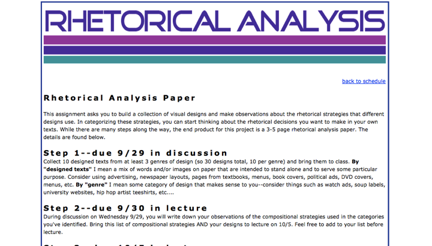
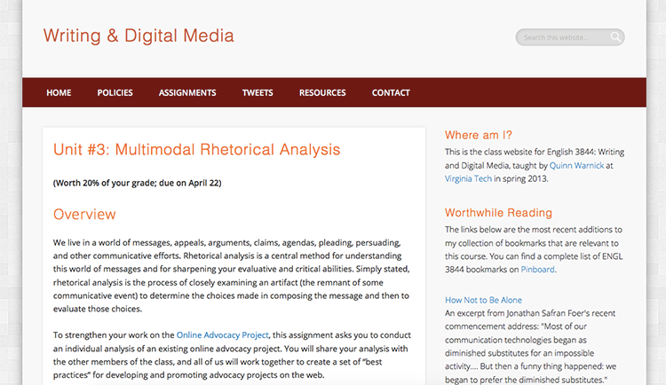
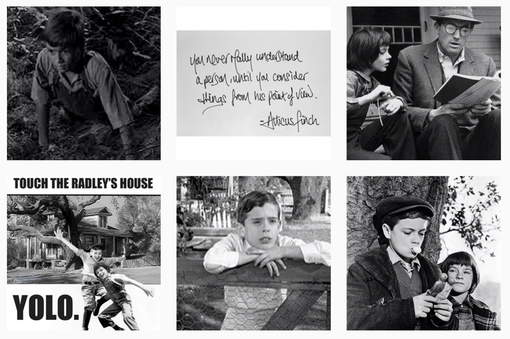
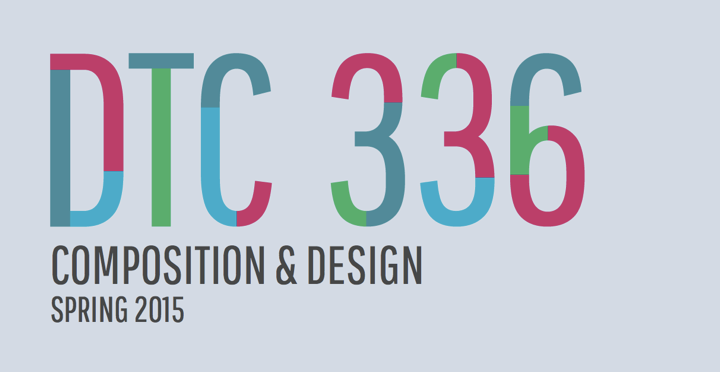
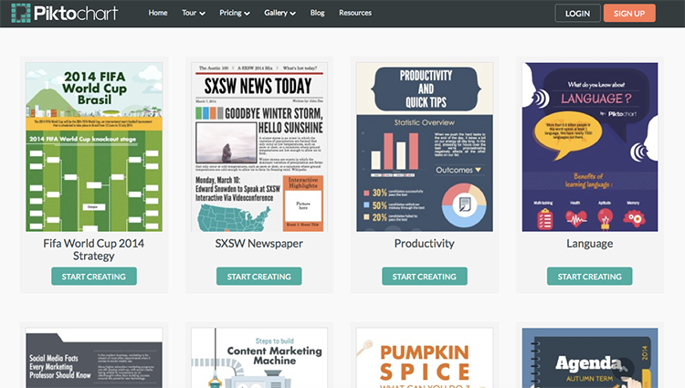
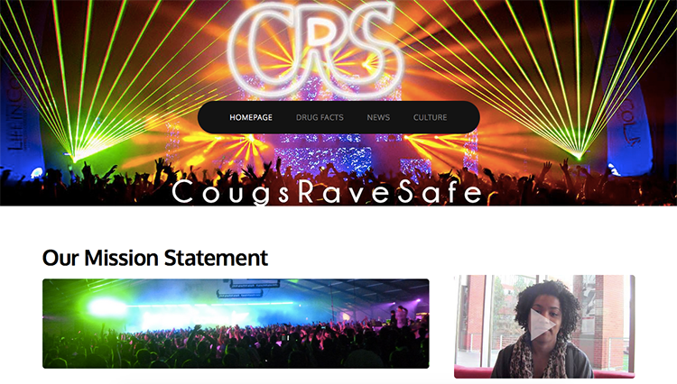
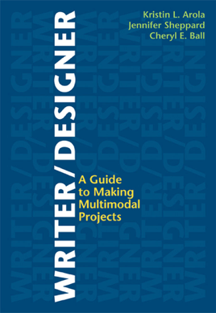
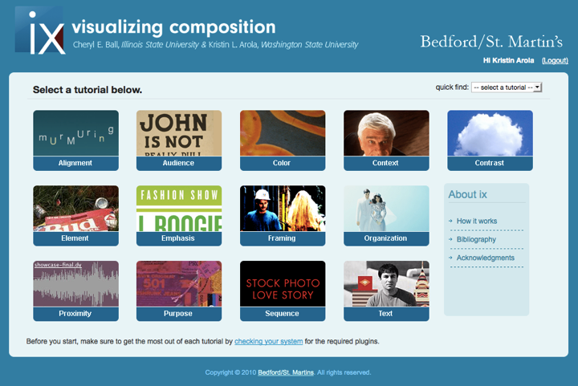
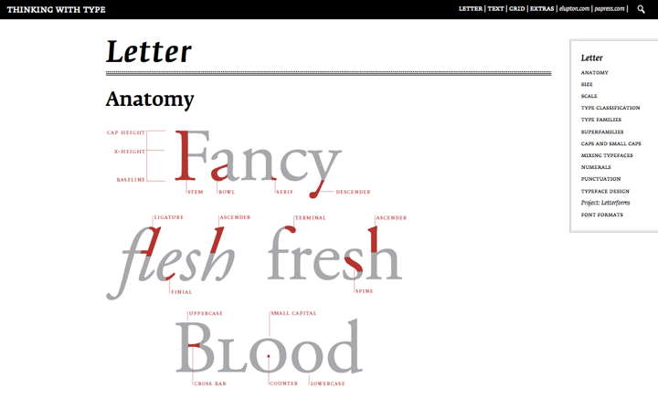

# DESIGN (Draft)
 
### Jennifer Sheppard 
San Diego State University 
### [Kristin L. Arola](http://arola.kuurola.com) 
Washington State University

---
##### Publication Status:
* unreviewed draft  
* **draft version undergoing editorial review** 
* draft version undergoing peer-to-peer review
* published

---

## CURATORIAL STATEMENT 
## 
In the context of digital pedagogy, we understand design as a holistic means for broadening and reframing the activities of meaning making. This approach recognizes that meaning is made not just through linguistic content but also through arrangement, context of use, and modes of expression. Rather than viewing communication in digital environments as a process of solely producing words for the screen, a design-oriented approach helps students learn to craft all aspects of communication at their disposal. Through purposeful design — the
thoughtful selection and integration of text, images, sound, space, and/or movement — students are able to utilize all available means of
persuasion to deliver a purposeful, rhetorically-savvy message to their intended audience.

Our use of the term "design" is inclusive of the creative invention and composing processes of a text and the specific rhetorical, aesthetic, and personal decisions that make the text what it is. Design refers both to the act of making and the artifact that is made. Our conception of design also relies necessarily on an understanding of all texts as multimodal. Even traditional print texts are constituted not just with words but also with visual and spatial considerations. All modes play a role in a text's meaning, and these possibilities have only expanded with ever-changing digital tools and environments. Thus, a design-oriented approach helps students develop practices that offer greater control over all avenues for meaning-making in whatever context they happen to be working.

The pedagogical resources gathered here connect with design as an opportunity to expand our notions of communication. To help leverage the affordances of emerging technologies, multiple modes of expression, and new expectations of readers/users, we advocate for the following pedagogical commitments for design, commitments that are further exemplified through our curated artifacts: 

1. First, we believe in having students *find and analyze numerous examples of communication in different modes and media* to encourage discussion and analysis of how and why different kinds of designs work (or don’t). We want students to have a common language for understanding the affordances of various media and the impact these have on how a message is communicated and received by particular audiences. In our classes, we often begin with an exploration of modal rhetorics through digital collection, curation, and analysis of sample texts. Using social bookmarking, cataloging, and/or blogging tools such as Pinterest or Tumblr encourages students to gather and share a wide variety of text types and modes of expression. These examples can then be discussed in class and/or used for critical investigation to identify particular affordances and rhetorical choices within various media. This analytical work is an important step in supporting students’ abilities to become deliberative communication producers.

2. Second, we believe in the need for *hands-on learning in context* (or what literacy scholars refer to as situated practice). Reading and analyzing texts (our first pedagogical commitment described above) and making texts are very different sets of practices. It takes time and experimentation to learn how to design and implement rhetorical strategies in particular media, even if one can point out how they function in texts made by others. Therefore, we advocate for an approach to *communication design as an exploratory practice.* Each new project requires a designer to adapt to the rhetorical demands of the particular situation or to consider ways in which they want to resist conventions or expectations. Identifying the unique needs of a given audience, purpose, context, and expected genre is not an exact science but a matter of trying out and finessing possibilities. There is no template for designing communication that will work in all situations. Learning to do so competently and persuasively requires sustained opportunities for practice. Further, as technologies continue to evolve, it is necessary for designers to experiment with new features and capabilities to understand what is possible and relevant. By approaching design as an exploratory practice, communicators are reminded that every new project is unfamiliar terrain. While some previous strategies and technologies may have applicability, they must be tailored to the new context. 

3. Finally, we believe that incorporating multiple opportunities for *critical self-reflection* is essential to students’ learning of design practices. Such activities call on students to move from implicit practice (just doing without considering why or how) to explicit understanding (the ability to name and explain the purposes of particular design choices). Through requiring students to write about and make conscious, deliberate design decisions in their projects, they are pressed to consider what worked, what didn’t, and how they might alter their approach in the future. If one of our primary goals as teachers of communication is to help students to be successful in any number of rhetorical environments in and beyond the classroom, pushing them to be mindful of their own practices and the affordances of the tools in their repertoire is a critical component of our digital pedagogy.

## CURATED ARTIFACTS 

These artifacts are curated into three categories based on our pedagogical commitments for design: 1) Analyzing Design, 2) Producing Designs, and 3) Critical Self-Reflection. These assignments and resources foster a discursive understanding of the designs students both produce and encounter.

## Part 1: ANALYZING DESIGN

Our first commitment to design involves finding and analyzing numerous examples. These assignments provide ways of engaging with design analysis across a range of courses and topics.

### Design Genre Analysis

* Source URL: http://arola.kuurola.com/302/fall10/final.html 
* Creator: Kristin Arola (via Anne Frances Wysocki)

This multi-step assignment asks students to collect and categorize designed texts from different genres. Students walk through a step-by-step process — from large-scale gathering of multiple texts to detailed categorization of one genre — eventually writing a rhetorical analysis exploring the conventions of a design genre. This assignment works well in a range of courses, from first-year composition to upper division business writing to digital media seminars. More specifically, it helps students learn to analyze how design is employed to address the rhetorical situation and calls attention to the role of genre conventions within design practices.

### Visual Communication Audit

* Source URL: https://www.msu.edu/~devossda/360/modules/module1.pdf from
a Visual Rhetoric and Document Design course,
https://www.msu.edu/~devossda/360/ 
* Creator: Danielle DeVoss

Focused on the professional writing classroom, this assignment asks students to identify an organization or company and to perform a visual audit. Students gather external communication (posters, flyers, handouts, reports, media releases, etc.) from the company or organization and analyze the work the visual aspects of these texts perform. The assignment allows students to explore how design choices help shape the message of a business or organization. 

### Multimodal Rhetorical Analysis

* Source URL: http://3844s13.quinnwarnick.com/unit3/ from a Writing &
Digital Media course http://3844s13.quinnwarnick.com/ 
* Creator: Quinn Warnick

While the first two artifacts in this list look more specifically at design, this assignment folds design into a multimodal rhetorical analysis assignment. It also asks students to specifically consider how the analysis work they are doing can lead to a list of best practices for their own productions. Encouraging students to dig deeply within design analyses while also considering how those analyses can contribute to theirown design practices is key in fostering a discursive understanding of design within digital pedagogy. Similar to how we ask students to analyze writing in the hopes they become more critical about reading and writing, this assignment asks students to analyze a multimodal text so as to become more critical about the multimodal texts they produce. More specifically, it asks them to take stock of the most effective strategies they encounter so as to produce a list of best practices for their own designs. This assignments helps make a bridge from analysis to production.

## Part 2: DESIGNING

Our second commitment to design is hands-on learning in context, or put more simply, designing. As described above, we believe students need practice in composing designs. Just as most English teachers believe students should both read *and* write alphabetic text, we believe students should both analyze *and* produce designs. These assignments ask students to mindfully engage in the design process.

### Remix a Story

* Source URL:
http://3844s15.tracigardner.com/assignments/project-4-remix-a-story/
(for a student example of *To Kill a Mockingbird* visit
https://community.macmillan.com/community/bedford-bits/blog/2015/07/28/
remixing-to-kill-a-mockingbird) 
* Creator: Traci Gardner

Redesigning asks students to consider how the design of a text encourages a certain understanding of that text. In this assignment, Traci Gardner asks her students to take an existing story told through the written word and translate it into a multimodal version. By asking students to think creatively about how to redesign and represent text in a new format, students must consider how the design choices they make have rhetorical effects. This assignment can be used in literature courses as a way of interrogating how a story is told, shaped, read, and understood through the modal choices used.

### Autobiographical Icons

* Source URL: 
  * Part 1, http://baddayeveryday.com/teaching/2015/spring/dtc336/project2_1
  * Part 2, http://baddayeveryday.com/teaching/2015/spring/dtc336/project2_2
  * Part 3, http://baddayeveryday.com/teaching/2015/spring/dtc336/project2_3
  * Assessment, http://baddayeveryday.com/teaching/docs/dtc336/DTC336_project_2_grading_sheet.pdf
* Creator: Jeff Kuure

In this three-part assignment, Jeff Kuure asks his students to develop a set of personalized icons that represent actions taken throughout the day. Students are asked to consider how icons function as design cues for particular audiences in particular situations. While the final project includes icons drawn through Adobe Illustrator, this assignment is easily modified for less technical courses where students could simply hand-draw the icon with a written description. Producing icons allows students to consider the ways in which simple design choices, when done well, can convey complicated meaning. It also helps students think through the ways they as audience members understand and use icons in their daily lives.

### Infographic Assignment

* Source URL:
http://williamwolff.org/courses/ia-spring-2013/ia-assignments-s13/ias13-
infographic-assignment/ 
* Creator: Bill Wolff

Infographics are visual representations of information or data and provide an interesting way of considering how design impacts the ways information is understood. The decision to represent wealth inequality through a line graph as opposed to icons of people drawn to scale to represent average salary, speaks to issues of purpose and audience and is an engaging way to help students see the rhetorical role of design. In this assignment, Bill Wolff asks his students to engage with Edward Tufte's and Ellen Lupton's theories of design, typography, and evidence presentation through creating infographics with Piktochart (a free online infographic creator). Along with producing an infographic, students also write a reflection in which they describe their objective, their rhetorical strategies, and the ways in which they engaged with Tufte and Lupton's theories of information design. While we have categorized this assignment under "Producing Design," it includes a nice balance of both producing and reflecting, thus enacting critical self-reflection, our third pedagogical commitment to design pedagogy as defined above.

### Informational Campaign

* Source URL: http://arola.kuurola.com/355/fall14/project4.html 
* Creator: Kristin Arola

In this assignment, Arola has her students work in groups to design an informational campaign that includes a clearly defined graphic identity, a short video, and a website. Students begin by analyzing other campaigns and composing a list of best practices, after which they work through a series of steps in order to complete the final product. While this assignment usually takes 5-7 weeks of a semester, pieces of it can be pulled to suit a variety of pedagogical goals. Design plays a large role in that students must consider how to best share information with an audience through the use of still and moving images. Students also engage in self-reflections throughout, giving a pitch presentation and also presenting the final project. While categorized within production, this assignment brings together analysis, production, and self-reflection, thus enacting all of our design pedagogy commitments.

## Part 3: CRITICAL SELF-REFLECTION

Our third pedagogical commitment to design includes incorporating multiple opportunities for critical self-reflection. So as to engage in self-reflection about the designs produced or encountered, students need a vocabulary to discursively engage with design. The analysis assignments in Part 1 suggest some ways of folding in terminology; however, these three artifacts provide specific vocabulary that we find useful. You might also consider turning to terminology you are already familiar with (from rhetorical analysis, film studies, document design, etc.).

### Writer/Designer: A Guide to Making Multimodal Projects

* Source URL:
http://www.macmillanhighered.com/Catalog/product/writerdesigner-firstedition-arola 
* Creators: Kristin L. Arola, Jennifer Sheppard, Cheryl E. Ball

As the authors of this textbook and this entry, we understand ourselves not so much as writing teachers, but as teachers of rhetoric who help our students leverage the communication options at their disposal. The title of our book, *Writer/Designer*, reflects our belief that writing and designing always work together. Whether we are authors working with words, images, sound, or movement, decisions about what the content says and how it looks and functions are necessarily entwined, even when we do not pay conscious attention to their relationship. The book moves students from analysis to production and provides both the language to discuss design choices as well as a step-by-step process for designing multimodal texts. With plenty of visual examples, *Writer/Designer* provides a design-based approach to multimodal composing.

### IX: Visualizing Composition

* Source URL: http://ix.bedfordstmartins.com/ 
* Creators: Cheryl E. Ball and Kristin L. Arola

IX is an online resource that provides thirteen concepts for exploring designed texts. Each tutorial defines the concept, provides examples, and then asks students to engage with that concept through small assignments. The concepts include the rhetorical situation (audience, purpose, context) along with rhetorical design strategies (alignment, color, contrast, emphasis, framing, organization, proximity, and sequence). Such language provides students with a vocabulary for talking about what works, and what doesn't work, in both the texts they encounter and the texts they design. The tutorials can be used in-class either as an instructor-led discussion where tutorials are projected and the class as a whole discusses them, or as individual or group work in a computer lab. It can also be used as out-of-class homework where assignments are completed and turned in to the instructor via the email interface in the tutorials.

### Thinking With Type

* Source URL: http://www.thinkingwithtype.com/ 
* Creators: Ellen Lupton and Christopher Clark

Designed as a classroom companion to Ellen Lupton’s book *Thinking with Type: A Critical Guide for Designers, Writers, Editors, and Students*, this website includes a wealth of information on the rhetorical effects of type. Specifically, through the use of visual examples, it calls attention to some of the key ideas from typography, including size, scale, type families, kerning, line spacing, and grids. Asking students to explore the rhetorical effects of type is often a very fruitful way of exploring design choices. The site also includes a wealth of lectures, project ideas, and handouts great for a range of classes, from media studies to document design to creative writing.

## RELATED MATERIALS
 
Arola, Kristin, Jennifer Sheppard and Cheryl E. Ball. “Multimodality as a Frame for Individual and Institutional Change.” *Hybrid Pedagogy*. Jan. 10, 2014. http://www.hybridpedagogy.com/journal/multimodality-frame-individual-institutional-change/

Arola, Kristin L. “The Design of Web 2.0: The Rise of the Template, the Fall of Design.” *Computers & Composition*, 27.1 (2010): 4-14. http://www.sciencedirect.com/science/article/pii/S8755461509000863

New London Group. “A Pedagogy of Multiliteracies: Designing Social Future.” Harvard Educational Review. 66.1 (1996). http://www.static.kern.org/filer/blogWrite44ManilaWebsite/paul/articles/A_Pedagogy_of_Multiliteracies_Designing_Social_Futures.htm

Sheppard, Jennifer. “The Rhetorical Work of Multimedia Production Practices: It’s More than Just Technical Skill.” *Computers and Composition*. 26.2 (2009): 122-131. http://www.sciencedirect.com/science/article/pii/S8755461509000206

Wysocki, Anne Frances, Johndan Johnson-Eilola, Cynthia L. Selfe &Geoffrey Sirc. *Writing New Media: Theory and Applications for Expanding the Teaching of Composition*. Logan, UT: Utah State University Press, 2004. http://www.usu.edu/usupress/books/index.cfm?isbn=5755
