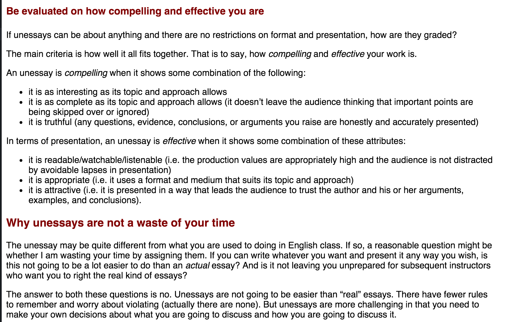
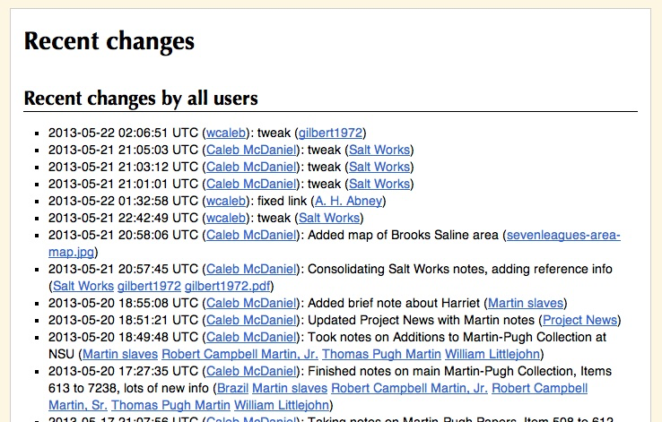
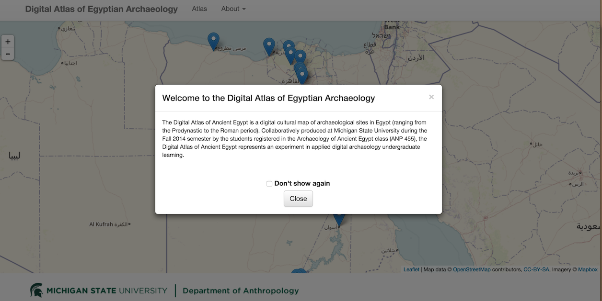
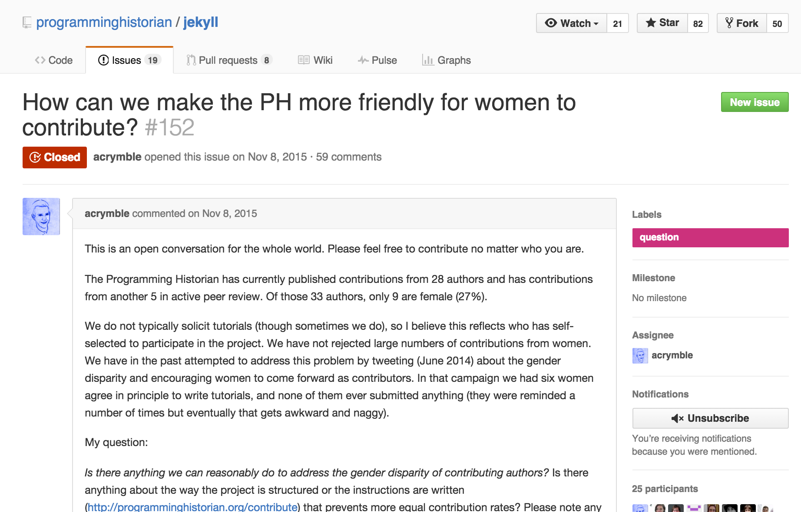
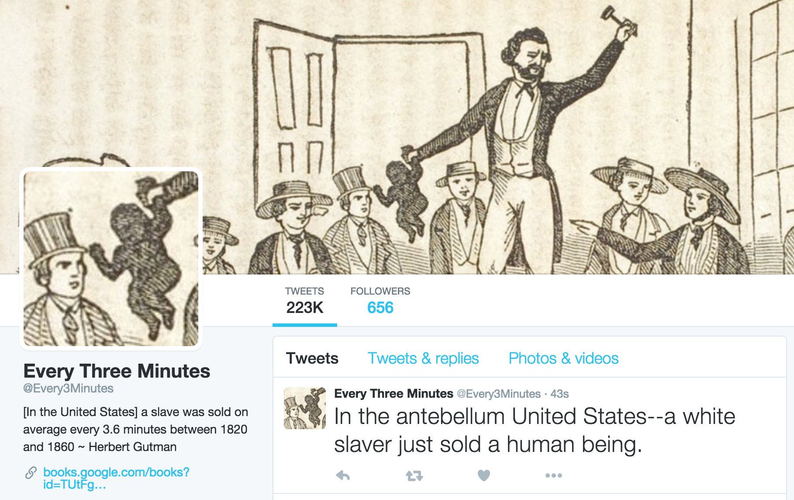

# HISTORY (Draft)

## SHAWN GRAHAM
Carleton University, Ottawa | http://electricarchaeology.ca

---

##### Publication Status:
* unreviewed draft
* **draft version undergoing editorial review**
* draft version undergoing peer-to-peer review
* published

---

## CURATORIAL STATEMENT

The essay looms large in the minds of our students as the thing above all else that historians _do_. "How many pages? How many words? How many sources?" If it isn't an essay, students balk, students resist. With good reason: the status quo signifier for historical seriousness, for scholarship, is indeed the essay (and its longer cousin, the monograph) (cf Blevins and Mullen 2015, p39). Digital work that transgresses this 'compulsory figure' (O'Donnell, 2012) is only slowly being recognized (Gibbs 2016; Robertson 2016; but see also the posts by Sheila Brennan listed below on reviews of digital work in academic scholarship). Since how we practice our scholarship informs our teaching, this transgression is what marks the difference between a digital pedagogy and mere online learning.

Online education is about the compulsory figures of academia, about recreating a controllable, observable classroom through a system that watches and monitors everything.  Essays are easy to track, easy to turn-it-in. Compulsory figures lend themselves well to instrumentalization and credentialism. Mere online education turns us into content providers for the system. Digital pedagogy by its transgressive nature cannot easily fit inside the systems that manage our learning, and allows us to resist the neoliberal program. A digital pedagogy (however instantiated) pushes beyond compulsory figures and breaks the system, whilst online learning merely reinforces those figures. Students will understandably resist, when compulsory figures are what they know and expect and _have become good at_. Digital pedagogies that do not fit into the managed system are good not only for our students, but for our universities as well. Learning management systems and 'best practices' impose a kind of sameness on every course that it strikes me is antithetical to what a University should be about.

For this keyword, I have selected artifacts that expand the realm of the possible, for showing how an expanded universe of historical writing can be folded into one's digital pedagogy in a way that transgresses the replicated-classroom model of online education.  My vision of what history means as a keyword in digital pedagogy is to remember what the _spirit_ of the essay (from the French, _essayer_, to try) entails. It was a wild thing, an exploration, in Montaigne's original formulation (in the 16th century; http://plato.stanford.edu/entries/montaigne/. It is in the 19th century that the rhetorical forms that come to dominate the classroom experience of the essay emerge, Mack 1993). To write an essay was to sketch out an experience, an argument, for the audience of a world where things might be different than they are here: in other words, it was a sort of simulation. Simulations and games, playful experiences, for an audience: digital pedagogy in history expands and reinvents Montaigne's essay in a form fitting for the age. This vision is very outward facing and so helps to turn our teaching inside-out; the teaching of history becomes an act of public history in this model. Public history is ever aware of its audiences. Montaigne's essays changed with time, as he reworked them and reconsidered them for _his_ various audiences. As in the discussion for the keyword [Public](public.md), the act of making work outward-facing is itself transgressive and transcends the closed systems described above. 

The artifacts collected for this keyword represent key moments/movements/examples that lay a pathway for us to employ this vision of a digital pedagogy of history, whether that teaching takes place in a classroom or in public, online or off. The artifacts are arranged in an order that should facilitate the integration of digital pedagogies into one's teaching and research. They move from a more theoretical grounding to concrete instantiated examples. To highlight a few, Mark Sample's assignment prompt discussed in his post, 'What's wrong with writing essays?', Daniel O'Donnel's framework for the 'unessay', and the HeritageJam's wonderfully eclectic inventions and inversions on museum collections or the concept of 'buried' (in archaeological contexts) provide some concrete examples of how to implement these ideas.

Digital pedagogy in history changes not just how we teach, but how we _do_, history - how we work on our own, with colleagues, with students, and with the public. All of these pieces are essays in the sense of _essayer_ to try, to experiment, to change the world a little bit.

## CURATED ARTIFACTS

## What's Wrong with Writing Essays?

+ Artifact Type: description of an assignment that imagines 'writing' to be more akin to 'making'
+ Source URL:http://www.samplereality.com/2009/03/12/whats-wrong-with-writing-essays/
+ Artifact Permissions: no license appears.
Copy of the Artifact (in HTML, PDF, DOCX, TXT, MD, RTF, MP3, MP4, MOV, PNG, or JPG), if possible
+ Creator and Affiliation: Mark Sample, Davidson College

This piece crystalizes the issue around essays: we are too much concerned with 'form' and forgetting about 'content'. Sample points out that 'text' derives from the Latin 'to weave', and uses that metaphor to suggest expanding the range of possibilities. Accordingly, Sample offers an example of an assignment designed to 'take the words out of writing', a prompt to create an 'abstract mapping' of a videogame's underlying complexity and representation of the world. A similar prompt could be devised for domains beyond the representation of history in videogames, for instance, the organization of an archival fonds (that is, the collection of documents originating from a single source).

## The Unessay

+ Artifact Type: assignment prompt
+ Source Url: http://people.uleth.ca/~daniel.odonnell/Teaching/the-unessay
+ Artifact Permissions: CC BY-NC-SA 3.0
+ Creator and Affiliation: Daniel Paul O'Donnell, University of Lethbridge

This assignment prompt documents problems with 'essays' as they have come to be in the modern undergraduate classroom. What's more, it provides a framework for re-situating them as digital pedagogy, returning agency to the student, and an entirely useful set of criteria for assessing work that does not look like traditional forms. The criteria provided can be transformed into a rubric with two criteria, that the work is 'compelling' and 'effective'. When we are dealing with students that come to our classes with widely varying backgrounds and varying degrees of digital literacy, [a rubric](https://github.com/shawngraham/highschoolhistorygaming/blob/master/rubric.md) can be a useful ways of calming these fears. Because the students can choose their _own_ platform, the focus shifts from technical competency to how the medium and the argument intersect, reinforce, or contradict each other. It takes seriously Marshall's old chestnut, 'the medium is the message'. 

## Open Notebook History

+ Artifact Type: blog reflection
+ Source Url: http://wcm1.web.rice.edu/open-notebook-history.html
+ Artifact Permissions: CC BY-SA 3.0
+ Creator and Affiliation: W. Caleb McDaniel, Rice University

McDaniel opens a dialogue with proponents of so-called 'open notebook science', and situates it within practices familiar to historians (a process similar to what Chad Black has called, ['Hacking the Papers of You'](https://parezcoydigo.wordpress.com/2010/05/28/the-individual-research-archive-hacking-the-papers-of-you/)). McDaniel argues that we cannot know the full value of what we have until we allow others to see it. He outlines the use of Gitit, a personal wiki program combined with Git versioning control, for maintaining such a notebook. Gitit has a steep learning curve and it is not recommended for new practitioners. A gentler option might be to use a combination of text editor and github repository to achieve the same effect (saving files to a folder on one's computer which are then synced to an open webpage that others may read or make a copy of). Open notebooks can be integrated into a course as both a way for students to keep track of the hidden 'gotchas' of doing digital work, and also as a way of 'showing their work'; since students all have different starting points with digital materials, these notebooks and the sharing of materials can be used to help build community and support. The inevitable fears of 'being scooped' or 'not being seen to be scholarly' can then be used for discussion of open access issues, gatekeeping, the culture of the academy. The open notebook can also be an effective introduction to open peer review journal and book projects, such as those undertaken by Michelle Moravec.

## Writing in Public

+ Artifact Type: web page
+ Source Url: http://michellemoravec.com/michelle-moravec/
+ Artifact Permissions: no license provided
+ Creator and Affiliation: Michelle Moravec, Rosemont College

This page is a landing page for Moravec's writing projects; her goal in writing in public is to demystify the processes of academic labour. She situates this goal within her research on women's liberation movements, as part of a tradition of work that breaks down the boundaries between public and private 'to reveal the politics underneath'. Moravec provides links to projects in progress, and projects completed. She uses a combination of google docs, twitter hashtags, and curated shortlinks to keep track of her readers' engagement with her work. Moravec's process, while different than the open notebook approach advocated by McDaniel, models for the student what a sustained engaged open practice looks like. It shows the authentic tasks of the historian and it normalizes this kind of work as something that historians just do. This helps to break down the small-c conservatism of what is 'appropriate' for historians. A professor could model this with her students by posting a piece of her own writing and limiting comments to the enrolled students, and rework the piece over the duration of the course in light of the students' developing engagement with the course materials, for instance. This would also have the effect of minimizing students' exposure to some of the more dangerous aspects of web-culture as it puts the focus on the professor rather than the students. The toxicity of web culture in our current moment is something that cannot be avoided, and if we are to work in public safely and effectively with our students we need to take into consideration the work of scholars like Tressie McMillan Cottom.

## Who do you think you are?

+ Artifact Type: journal article
+ Source Url: http://adanewmedia.org/2015/04/issue7-mcmillancottom/
+ Artifact Permissions: CC BY-SA 4.0
+ Creator and Affiliation: Tressie McMillan Cottom, Virginia Commonwealth University

It can be dangerous when we break down the walls of our teaching and research, and expose these processes to the wider world. In "Who do you think you are?", Tressie McMillan Cottom analyzes the sociology of the performative attention economy of online work. She exposes the ways that if you don't look like a white man online, what can or cannot be done in terms of a public-facing digital work becomes much more complicated and dangerous. The piece serves as a counterbalance to the artifacts discussed above. As a white man, I am insulated by privilege and I can recommend tools and integrate approaches that do not work (or are not safe) for everyone. A new practitioner of digital pedagogy needs to balance and negotiate with their students these zones (see also Cathy Davidson on [negotiating the syllabus with students](https://www.hastac.org/blogs/cathy-davidson/2015/08/06/getting-started-pt-3-syllabus)). Cottom's piece enables this conversation to happen and should be used as a discussion prompt and a point of departure for negotiation over degrees of exposure to the wider web.

## Digital Atlas of Egyptian Archaeology (DAEA)

+ Artifact Type: class project
+ Source Url: https://matrix-msu.github.io/daea/ (Source code at [https://github.com/matrix-msu/daea-fs14](https://github.com/matrix-msu/daea))
+ Artifact Permissions: GNU General Public License
+ Creator and Affiliation: Students in the Fall 2014 semester in the Archaeology of
Ancient Egypt class (ANP 455) at Michigan State University, led by Ethan Watrall and supported by Brian Geyer.

The Digital Atlas of Egyptian Archaeology (DAEA) as a work of collaborative scholarship exemplifies many of the ideas that the previous artifacts point towards. Writing and researching in public includes not just _text_ but also the _code_ that enables digital scholarship. Moreover, the act of putting the source code online allows this student scholarship to be leveraged by other students, expanded, and transmogrified. Christina Ross forked this and repurposed it to become a microhistory of St. John's, Newfoundland http://xtina-r.github.io/daea/, which was then repurposed and extended by Rob Blades (http://pembrokesoundscapes.ca). Ross's version is on the syllabus in Jeffery McClurken's 'Adventures in Digital History'. (http://courses.mcclurken.org/adh/syllabus/). The DAEA shows ways that student work can have impact beyond the classroom.

## TEI Close Reading Exercise

+ Artifact Type: exercise
+ Source Url: https://github.com/mhbeals/TEI-Close-Reading
+ Artifact Permissions: CC-BY
+ Creator and Affiliation: Melodee Beals, Loughborough University

While marking up text and annotation has long been a staple of digital humanities work, Beals' exercise does the necessary heavy lifting to make it clear how one could teach TEI (the Text Encoding Initiative is a set of standards for the digital annotation of primary sources) and the pedagogical value of a digitally informed close reading. In its clarity of exposition, and in its arrangement of materials and organization, it is a good model for the new practitioner of digital history pedagogies to emulate. Beyond the narrow concerns of TEI, this exercise demonstrates how exposing our research and teaching materials to the world (in this case, via a repository on Github) builds teaching capacity for the rest of us. Some academic journals are now beginning to include digital teaching materials as part of their remit (notably, the [Journal of Interactive Technology and Pedagogy](https://jitp.commons.gc.cuny.edu/) has sections on 'teaching fails' and 'blueprints' for exercises). Beals' use of github enables a powerful, quicker, model for sharing and collaborative, distributed building that journals typically can't promote. A useful exercise for students can be to try to _improve_ the exercise by expanding on the parts that tripped them up. They can then issue a pull request to the original author of the materials who may choose to incorporate or ignore the request, giving them a taste of what real-world collaboration is like. (A publicaton that _does_ incorporate this Github strategy is _The Programming Historian_.)

## The Programming Historian, issue #152

+ Artifact Type: issues thread
+ Source Url:https://github.com/programminghistorian/jekyll/issues/152)
+ Artifact Permissions: presumably CC-BY
+ Creator and Affiliation: Adam Crymble, Miriam Posner, et al.

[The Programming Historian team](http://programminghistorian.org) has long sought to make the processes of publication, peer review, of digital work in History, transparent and accountable. This thread in particular, with its thoughtful and wide-ranging discussion, which does not shy away from some hard truths shows a community of practice around digital pedagogy and capacity building wrestling with an issue in a way that is collegial, humble, and open. The issues of political economy of digital writing in the academy highlighted by Moravec and Cottom are seen in action in this thread. In which case, in courses that rely on discussion forums as the primary pedagogical tool, this artifact is particularly helpful. Examples of spontaneous productive online conversations, within the ambit of digital history and digital pedagogy, are not easily found. This discussion featuring the editors and contributors to the Programming Historian is a model for productive online discussion where there are important issues at stake and where there are markedly different opinions on how best to proceed.

## The HeritageJam

+ Artifact Type: website
+ Source Url: http://heritagejam.org
+ Artifact Permissions:
+ Creator and Affiliation: Andrew Masinton, Sarah Perry, Tara Copplestone, Izzy Bartley. University of York.

Having just gone through its second iteration, the Heritage Jam is an annual two-day event, where participants collaborate to make something along a particular theme, from a particular collection, with a decidedly public-facing inflection. It brings together participants both live (in a kind of camp-out) and online. Aside from the wonderful things participants make, the Jam rules require them to document the _paradata_ that supports the work. The paradata document draws on a long history in archaeological research of visualizations and making (there is an entire subfield, 'experimental archaeology', which has strong affinities to digital humanities pedagogy and deformance) as codified in the 2009 London Charter of Heritage Visualization (http://www.londoncharter.org/) . Paradata "provide the space through which we communicate ambiguity and transparency, and account for our practices". In this way, the viewers learn how to think critically about the construction of the past. In many respects, the concept of paradata for digital work ties into other kinds of reflective pedagogical practice such as eportfolios. Paradata enable novel forms of digital work to fit into the existing patterns and expectations of assessment, even while they subtly shift the goalposts of what becomes 'normal' in historical work.

## Every Three Minutes

+ Artifact Type: twitter robot
+ Source Url: https://twitter.com/every3minutes, associated post detailing why 3 minutes, and the source research at http://wcm1.web.rice.edu/slave-sales-on-twitter.html
+ Artifact Permissions:
+ Creator and Affiliation: W. Caleb McDaniel, Rice University

Our teaching and research, when freed from the confines of an essay, can literally have a kind of algorithmic agency (what Mark Sample calls a ['bot of conviction']( https://medium.com/@samplereality/a-protest-bot-is-a-bot-so-specific-you-cant-mistake-it-for-bullshit-90fe10b7fbaa#.k7zhd3p6e)). Such a creature directly confronts the public with the past. Originally devised as a backdrop to a classroom lecture, the affordances of the online medium, of twitter-as-platform-for-building, are used to devastating effect in the regular monotony of an update, every three minutes. Zach Whalen has an excellent tutorial on how to make simple twitter bots at [http://www.zachwhalen.net/posts/how-to-make-a-twitter-bot-with-google-spreadsheets-version-04/](http://www.zachwhalen.net/posts/how-to-make-a-twitter-bot-with-google-spreadsheets-version-04/). A simple version of this idea could be effected in the classroom by having a powerpoint presentation set with a timer to page automatically through the slides. An important role of the historian is to humanize the past, while confronting the audience with the simultaneous alienness of it. The use of this kind of bot as a counterpoint to the lecture or discussion demonstrates a use of digital tools for pedagogy as a kind of co-teacher.

## RELATED MATERIALS

Elliot, Devon, Robert MacDougall, and William Turkel. "New Old Things: Fabrication, Physical Computing, and Experiment in Historical Practice." _Canadian Journal of Communication 37.1_ (2012). Web. <http://www.cjc-online.ca/index.php/journal/article/view/2506>.

Kelly, Mills. _Teaching History in the Digital Age_. Ann Arbor, MI: U of Michigan Press, 2013. Web. <http://quod.lib.umich.edu/cgi/t/text/text-idx?cc=dh;c=dh;idno=12146032.0001.001;rgn=full text;view=toc;xc=1;g=dculture>.

Lutz, John, Ruth Sandwell, et. al. "We Need Your Help!" _Great Unsolved Mysteries in Canadian History._ Canadian Heritage / University of Victoria, 1997. Web. 24 Feb. 2016. <http://canadianmysteries.ca/en/index.php>.

Nowviskie, Bethany. “Ludic Algorithms.” In _Pastplay: Teaching and Learning History with Technology_, edited by Kevin Kee, 139-71. Ann Arbor: University of Michigan Press, 2014. Web. <http://quod.lib.umich.edu/d/dh/12544152.0001.001/1:5/--pastplay-teaching-and-learning-history-with-technology?g=dculture;rgn=div1;view=fulltext;xc=1#5.3>

Terras, Melissa. "A Virtual Tomb for Kelvingrove: Virtual Reality, Archaeology and Education." _Internet Archaeology_ 7. Department of Archaeology, York University, 1 Dec. 1999. Web. 24 Feb. 2016. <http://intarch.ac.uk/journal/issue7/terras/>.

## WORKS CITED

ANP 455. "Digital Atlas of Egyptian Archaeology." Digital Atlas of Egyptian Archaeology. _MATRIX_, Michigan State University, Fall 2014. Web. 24 Feb. 2016. <https://matrix-msu.github.io/daea/>

Beals, Melodee. "TEI Close Reading." _GitHub.com/mhbeals_. 30 Dec. 2014. Web. 24 Feb. 2016. <https://github.com/mhbeals/TEI-Close-Reading>.

Blevins, Cameron, and Lincoln Mullins. "Jane, John ... Leslie? A Historical Method for Algorithmic Gender Prediction." _DHQ: Digital Humanities Quarterly_ 9.3 (2015). <http://www.digitalhumanities.org/dhq/vol/9/3/000223/000223.html>

Brennan, Sheila (@sherah1918). "Additional 100s were done for History Matters, starting in '99, http://historymatters.gmu.edu/browse/wwwhistory/" February 18, 2016, 11:01 am. <https://twitter.com/sherah1918/status/700364507747590144>

Brennan, Sheila (@sherah1918). "Also digital history reviews have appeared in Common-Place, The Public Historian. W&M Quarterly started in '99 http://oieahc.wm.edu/wmq/openwmq_digital.cfm" February 18, 2016, 11:08 am. <https://twitter.com/sherah1918/status/700366222832041984>

Brennan, Sheila (@sherah1918). "RE: lack of regular professional review of digital history projects, since 2001, Journal of Am History has reviwed ~275 web projects." February 18, 2016, 10:56 am <https://twitter.com/sherah1918/status/700363335078903809>

Brennan, Sheila (@sherah1918). "The Public History Resource Center started in 2000, and published digital project reviews for a few years: http://www.publichistory.org/reviews/ " February 18, 2016, 11.03 am. <https://twitter.com/sherah1918/status/700365148251410437>

Cottom, Tressie McMillan. ""Who Do You Think You Are?": When Marginality Meets Academic Microcelebrity." _Ada: A Journal of Gender, New Media, & Technology_ 7 (2015). Web. <http://adanewmedia.org/2015/04/issue7-mcmillancottom/>.

Crymble, Adam, Miriam Posner, et. al. "How Can We Make the PH More Friendly for Women to Contribute? · Issue #152" _GitHub.com/programminghistorian_. 8 Nov. 2015. Web. 24 Feb. 2016. <https://github.com/programminghistorian/jekyll/issues/152>

Gibbs, Frederick W. "New Forms of History: Critiquing Data and Its Representations." _The American Historian._ Organization of American Historians, Issue 7, Feb. 2016. Web. 24 Feb. 2016. <http://tah.oah.org/february-2016/new-forms-of-history-critiquing-data-and-its-representations/>.

Mack, Peter. “Rhetoric and the Essay”. Rhetoric Society Quarterly 23.2 (1993): 41–49. <http://www.jstor.org/stable/3885924>

Masinton, Anthony, Sarah Perry, Tara Copplestone, and Izzy Bartley. "The Heritage Jam." _The Heritage Jam_. Department of Archaeology, York University, 2014. Web. 24 Feb. 2016. <http://www.heritagejam.org/>.

McDaniel, W. Caleb. "@Every3Minutes." _Twitter_, 15 Nov. 2014. Web. 24 Feb. 2016. <https://twitter.com/every3minutes>.

McDaniel, W. Caleb. "Open Notebook History." Weblog post. _W. Caleb McDaniel_. 22 May 2013. Web. 24 Feb. 2016. <http://wcm1.web.rice.edu/open-notebook-history.html>

Moravec, Michelle. "Writing in Public." _Michelle Moravec_. 11 Jan. 2013. Web. 24 Feb. 2016. <http://michellemoravec.com/michelle-moravec/>.

O'Donnell, Daniel Paul. "The Unessay." Weblog post. _Daniel Paul O'Donnell_. 4 Sept. 2012. Web. 24 Feb. 2016. <http://people.uleth.ca/~daniel.odonnell/Teaching/the-unessay>

Robertson, Stephen. "Reviewing Digital History: An Exchange on Digital Harlem in the American Historical Review." Web log post. _Dr Stephen Robertson_. N.p., 11 Feb. 2016. Web. 24 Feb. 2016. <http://drstephenrobertson.com/article/reviewing-digital-history-digital-harlem-in-the-american-historical-review/>

Sample, Mark. "What's Wrong With Writing Essays?" Weblog post. _Sample Reality_. N.p., 12 Mar. 2009. Web. <http://www.samplereality.com/2009/03/12/whats-wrong-with-writing-essays/>.
