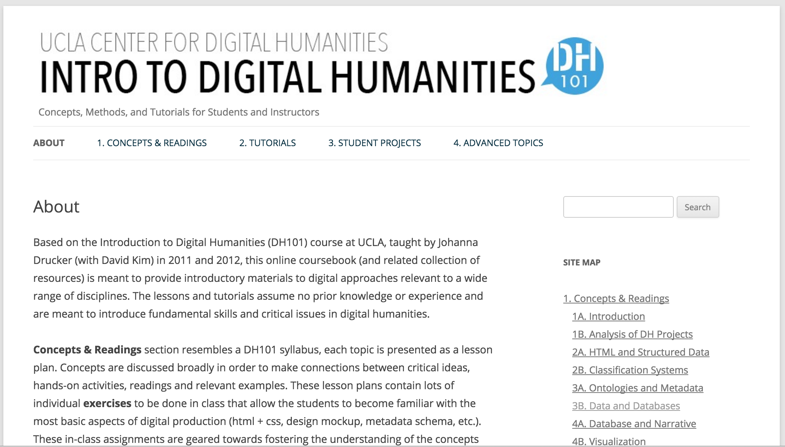
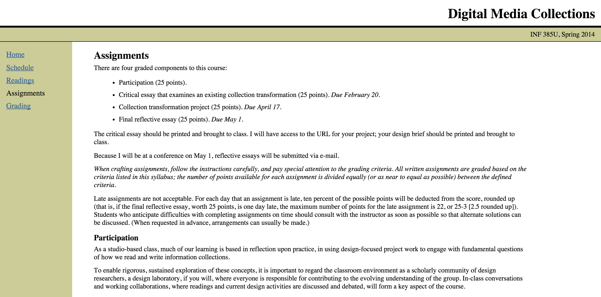
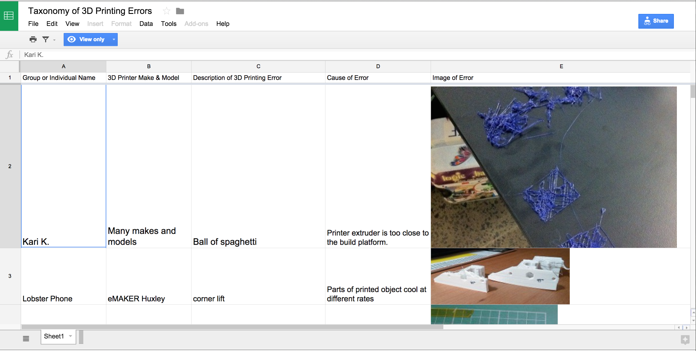
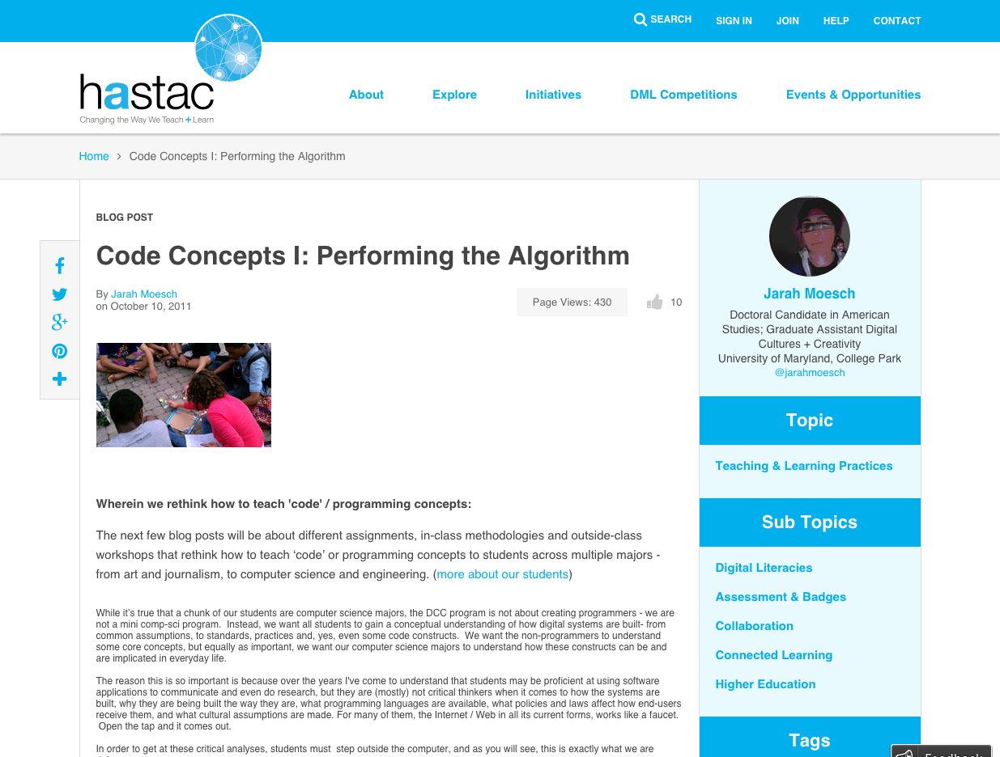
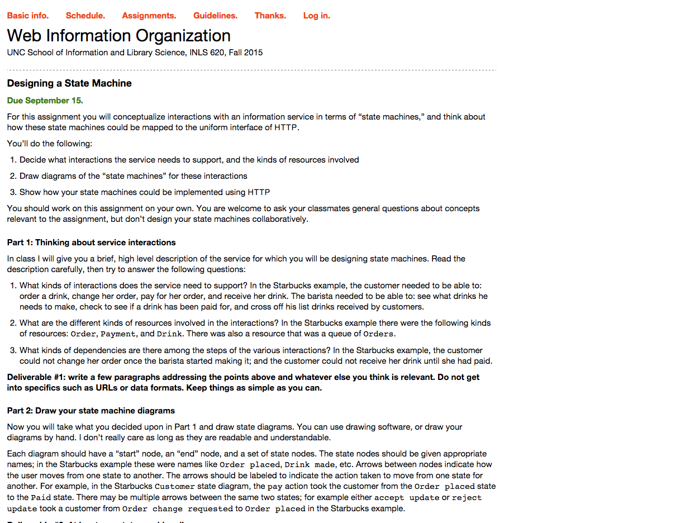
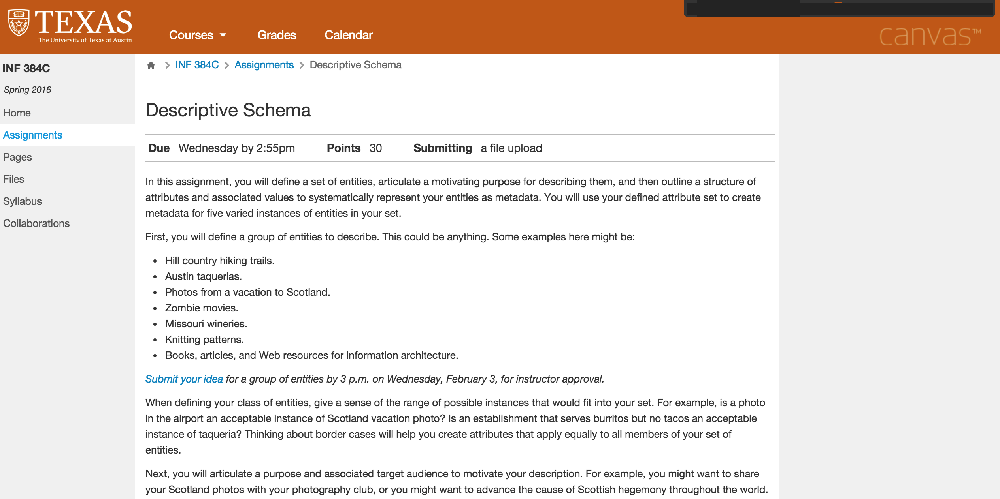

# INFORMATION (Draft) 

### Tanya Clement
University of Texas at Austin 

### Daniel Carter 
University of Texas at Austin 

---

##### Publication Status:
* unreviewed draft
* **draft version undergoing editorial review**
* draft version undergoing peer-to-peer review
* published 

--- 

## CURATORIAL STATEMENT

In the data, information, knowledge, wisdom (DIKW) hierarchy that circulates through Knowledge Management (KM) and Information Science (IS) discussions, *data* appears at the base of a pyramid of which wisdom is the pinnacle. In this schematic, *data* is “raw” and lacking in meaning, while *information*, the next higher level of the pyramid---just below *knowledge* and then *wisdom*---represents the presence of added links and relationships; *information* is higher up on the wisdom chain because it is *data* made meaningful (Sharma 2004). At the same time, in digital humanities, discussions about *data* have typically reflected an understanding of data as *capta* (Drucker 2011). That is, data is not found in the “raw” but has rather been cooked all along, taken and constructed, seasoned according to our situated contexts---a dash of access issues (*Where* is the data?); a pinch of media, format, and technology constraints (*How* is the data?); a squeeze of the juice that is cultural bias (*What* is the data? *Who* is involved in and impacted by its creation and use?). In this context, data is already full of made meanings. So, what is *information*?

In literary culture, *information* has taken on the flavor of what KM and IS view as raw data. Pitted against “the literary,” *information* has been considered an authorless and uninterpretable gush that distracts our attention from more important topics of concern (Marche 2012). This is not just a 21st-century perspective, fostered in the digital age; it is a critique we also see in T.S. Eliot’s “The Rock”: “Where is the Life we have lost in living? Where is the wisdom we have lost in knowledge? Where is the knowledge we have lost in information?” (1934) We see it as well in Gertrude Stein’s short piece “Reflection on the Atomic Bomb”: “They asked me what I thought of the atomic bomb. I said I had not been able to take any interest in it . . . Everybody gets so much information all day long that they lose their common sense. They listen so much that they forget to be natural. This is a nice story” (1946). More recently, in a discussion on Kenneth Goldsmith’s “uncreative” poetry in *PMLA*, Scott Pound writes that Goldsmith’s method for transcribing speech from recordings of every-day conversations and radio shows (not to mention his conceptual art project “Printing out the Internet” and his controversial decision to perform Michael Brown’s autopsy as poetry) is “poetry that treats language as so much data or information, chosen for its quantitative rather than its qualitative allure, prized for its mass and availability rather than its originality or aesthetic value” (317-3-18). *Information*, according to Pound, is “fragmentary, disjunctive, and radically exterior to the subject,” estranged from ontology and epistemology (??). In direct contrast to the definition we see in Knowledge Management and Information Science, where *data* is meaningless and *information* is meaningful, the *information* we see in these conversations is so much junk: while considered factual and evidentiary, it is abstract, autonomous, and objective---a massive, available, st(r)eaming raw data dump. This is a nice story. Like illusions of data as anything other than *capta*, this kind of narrative about *information* lets the author set aside the complicated, situated contexts that comprise digital, networked systems.

On the contrary, we do more rigorous work when we understand and teach our students that digital, networked systems reflect cultural contexts. In an attempt to learn to think more critically about these information systems, the pedagogical resources gathered here provide an opportunity to understand the keyword *information* as a mode of reading and writing. For example, when Geoffrey Nunberg writes that “information is a mode of reading,” he is arguing that how we understand *information* in the digital age is based on the forms and contexts in which we have historically been given access to content such as through newspapers, encyclopedias, and travel guides. The properties ascribed to *information,* he argues, — “its metaphysical haeceity or ‘thereness,’ its transferability, its quantized and extended substance, its interpretive transparency or autonomy — are simply the reifications of the various principles of interpretation that we bring to bear in reading these [historical] forms” (14). As such, the *informativeness* or *information-ness* of content has always been premised by our understanding of the content’s social context and its form. Learning to think critically about *information* and to reject illusions of objectivity, impersonality, atemporality, and authorlessness, we learn to talk about the personal, subjective and situated contexts of our readings in the context of information systems. Accordingly, with such critical perspective, we learn to write---or conceive of or even develop---information systems in ways that bely these concerns.

We have chosen pedagogical lessons and artifacts that reflect this critical stance towards information as reading and writing. Michael Buckland identifies three meanings for information that we have used to guide our selection criteria: *information-as-knowledge*, *information-as-thing*, and *information-as-process*. For Buckland, an understanding of *information-as-knowledge* underpins a critical stance towards *information* generally since knowledge is personal, subjective, and conceptual, but *information-as-thing* requires a critical stance to its material nature since to communicate the personal, the subjective, and the conceptual “they have to be expressed, described, or represented in some physical way, as a signal, text, or communication” (351). Information-as-process or “the act of informing” necessitates a consideration for what Foucault would call “an archaeology of knowledge”---or a consideration for the systems of power and influence that shape the information systems that process *information-as-thing* and therefore knowledge production, identity construction, and intersubjectivity. All of the items curated here ask students to read and write *information*-as-knowledge, -as-thing, and -as-process and to understand concepts such as *data*, *information*, and *knowledge* as interdependent though not necessarily coterminous.

## CURATED ARTIFACTS

### DH101: Intro to DH

* Source: [http://dh101.humanities.ucla.edu/](http://dh101.humanities.ucla.edu/?page_id=148)
* Copy of artifact: forthcoming
* Creator: Johanna Drucker (University of California, Los Angeles)

This syllabus for an undergraduate course demonstrates a careful consideration for information as knowledge, thing, and process. For example, the module “Data and Databases” asks students to consider the constructed nature of data as *capta*, as phenomena that are considered, by nature, quantifiable and thus, adherent to a prescribed scale or unit or system of measurement. In this way, structured data can preclude certain modes of interpretation (subjective, non-normative) while facilitating others. Further, the tutorial “Managing Data” using Google Drive’s Fusion Tables guides students through the process of considering a series of questions about overarching concepts such as data creation, data management, and data visualization through the process of visualizing a network from a data table they have constructed. Using the complex network maintained by the characters of the television drama, *Lost,* students create the “data” or names from the show, categorize them into types of their own choosing, and define relationships between entities. Next, students upload their data and create an undirected graph using Google’s Fusion Tables. Finally, students are asked to compare their network graph to the information rich spreadsheet they originally created and are reminded to consider how entities may easily defy labels and how the various relationships could be represented differently. Ultimately, in this course, students learn to think critically about how ambiguities that are present in subjective content may be hidden in structured data formats.

### Design Transformation

* Source: http://courses.ischool.utexas.edu/feinberg/2014/spring/INF385U/assignments.html
* Copy of artifact: forthcoming
* Creator: Melanie Feinberg (University of North Carolina)

The central objective of this course is to “investigate how the notion of residuality, or the experience of being insufficiently described via a classification system, can be actively enacted as part of an information collection's descriptive infrastructure (metadata).” With this objective in mind, this assignment asks students to enact the notion of residuality by revising the descriptive infrastructure (including the metadata and other customizable elements) of an existing digital collection to create an experimental transformation. Students are asked to identify an overall design approach and to consider how descriptors, summaries/abstracts, titles, responsible entities, dates, key frames, tags, collections and playlists can be potential design elements that can be used to realize residuality. ln a critical piece that accompanies this project, students are to think critically about the designer’s modes of reading and writing—their interpretive understanding of constituent materials and of what collection authorship entails—and the authoring environment participates in digital collection design.

### Data-Based Project and Analysis

* Source: http://lkleincourses.lmc.gatech.edu/data13/files/2013/01/final.pdf
* Copy of artifact: forthcoming
* Creators: Lauren Klein (Georgia Tech)

“Data-Based Project and Analysis” is a final course assignment that builds on students’ prior work on visualization and other “data” topics to critically consider how the rhetorical properties of data representation affect meaning. Students choose a dataset and represent or reconfigure it in a way that makes an argument “about it, about visualization, or about data more generally.” Projects can take the form of finished visualizations or similar artifacts; they can also be presented as proof-of-concept for a product that cannot be completed in a semester. Students also produce an essay to accompany their project that considers how its argument is constructed. The concepts these arguments can address are especially wide: Klein gives as examples epistemology, history, identity, art, narrative, publics, and more. However, this breadth makes clear the far-reaching consequences of data and their representation.

### Printing Fictions

* Source: https://docs.google.com/document/d/1ELJW5jNMvA7kkXKKX8aMXPzIcPCkCROAQ3O6IyVC0pw/edit
* Copy of artifact: forthcoming
* Creator: Kari Kraus (University of Maryland, College Park)

Information is not just about contextualizing data. The machines we use to generate, manage, understand, and share our views of the world are also part of how we think critically about the information landscape. This assignment for graduate and undergraduate students asks them to consider how 3D printing errors may be inspirational and spur innovative design. Students make an argument about Philip K. Dick’s "Pay for the Printer" through 3D printed things. Asked to design their own versions of the deformed artifacts, tools, and objects described in Dick's post-apocalyptic world and display them in a diorama, students use a "taxonomy of errors" to systematically document and classify 3-D printing errors that eventually form the basis of their designs. This process of collection and categorization includes documenting one or more 3-D printers (make and model) associated with the error; a description of the error; the cause of it; an image of it; and the source for more details about it. In addition to contributing entries to the spreadsheet, all of the students are asked to organize, group, or classify the errors into a meaningful system. Through this assignment, students are introduced to a critical perspective on the value of noticing and interrogating a technology’s "break down" or the moments in which the processes or algorithms of an information system such as a 3-D printer become apparent to the user.

### Information and Contemplation

* Source: http://cyborganthropology.com/Infomation\_and\_Contemplation:\_University\_of\_Washington\_Information\_School
* Copy of artifact: forthcoming
* Creator: David Levy (University of Washington)

This assignment is part of a course on information and contemplation designed to investigate contemporary questions of information overload and the fragmentation of attention. Unlike other artifacts collected here, the assignment focuses on the lived experience of systems such as email and social media platforms, asking students to consider not just what these systems are but how they structure their days and makes themselves felt on a bodily level. Students examine their information practices by keeping a journal of their email use and later reflecting on patterns found there, as well as alternative practices that might respond to these patterns. Throughout the assignment, attention is specifically called to compulsive behavior and the feeling of being overwhelmed. By highlighting the lived experience of contemporary technologies, the assignment invites students to critically consider their own practices and the extended networks (social, phenomenological, technical) in which information participates. In this way, it reminds that information is not just a thing but also a process and that the process of becoming informed has differed in important ways through time.

### The Life and Death of Data

* Source: [http://lifeanddeathofdata.org/](http://lifeanddeathofdata.org/)
* Copy of artifact: forthcoming
* Creator: Yanni Loukissas (Georgia Tech)

This project, titled “The Life and Death of Data” and described by its creator as a “data documentary,” is included here as an example of how data, seen through processes of collection and transformation, can be not only an object of inquiry but also a means of communicating or informing. The project focuses on accession records of the Arnold Arboretum, a collection of trees and other plants managed by Harvard University. Accompanied by a visualization of these data, the text draws on interviews with arboretum staff to construct an institutional narrative that centers on the organizational structures and values that influence collection and documentation practices. Within this narrative, somewhere between digital records and personal interviews, the workings of information-as-process become visible. In this way, the project serves as an argument about the expansive contexts pertinent to studying information as well as about how data or information-as-thing can inform through narrative. In a classroom setting, the project could serve as an example of the kind of critical reflection on data, information and representation that Lauren Klein’s “Data-Based Project and Analysis” assignment, included here, asks students to perform.

### Performing the Algorithm

* Source: [https://www.hastac.org/blogs/jarah/2011/10/10/code-concepts-i-performing-algorithm](https://www.hastac.org/blogs/jarah/2011/10/10/code-concepts-i-performing-algorithm)
* Copy of artifact: forthcoming
* Creator: Jarah Moesch (University of Maryland, College Park) 

“Performing the Algorithm” is an activity developed for the Digital Cultures and Creativity program at the University of Maryland, College Park. Intended to give students a basic conceptual understanding of algorithms, the activity also gives non-technical students a foundation on which to build a critical stance toward information processes. Groups of students create algorithms, or sets of instructions, for moving through and engaging space (defined broadly—physical, virtual and conceptual space are all given as examples). Examples of algorithms created in this way include instructions to play a game, perform a play or enact a programming principle. These algorithms are then passed to another group for enactment and documentation. Rather than asking students to directly critique existing information processes, this activity focuses on giving them the conceptual understanding, gained through practice, on which future critiques might build.

### Data Critique

* Source: [http://courses.digitaldavidson.net/dig210/guidelines/data-critique/](http://courses.digitaldavidson.net/dig210/guidelines/data-critique/)
* Copy of artifact: forthcoming 
* Creator: Mark Sample (Davidson College)

This assignment is part of a larger undergraduate course in the Digital Studies interdisciplinary minor at Davidson College. It seeks to teach students to think critically about how an understanding of data and databases ties to the ways in which we understand the world. The assignment, “Data Critique,” asks students to think about datasets as “articulations of power, with built-in assumptions, silences, and even anxieties.” Students are asked to find a dataset (or to consider a dataset they may have created themselves), and to interrogate its origins, what that dataset foregrounds and what it occludes, what impact those inclusions and omissions may have on who can interact with it and to what ends. The end result is a paper that discusses the social and cultural context of the dataset. The strength behind this assignment is the extent to which it requires students to consider how we can think about data in terms of its implicit claims about the world.

### Designing a State Machine

* Source: https://aeshin.org/teaching/inls-620/2015/fa/assignments/
* Copy of artifact: forthcoming
* Creator: Ryan Shaw (University of North Carolina) 

Ryan Shaw’s “Designing a State Machine” assignment asks students to consider how real-world interactions such as ordering a cup of coffee at Starbucks could be modeled as information systems and implemented using contemporary web technologies such as HTTP. The assignment consists of several steps: students first describe a context and identify the interactions (e.g., ordering a drink), resources (e.g., an order, a drink, a payment) and dependencies (e.g., a customer cannot pay for a drink before it is ordered). Students then diagram the “states” involved and how they are traversed—for example, moving from the “order placed” state to the “payment received” state is accomplished through the action of paying. The final step of the project calls for students to describe how the system could be implemented using contemporary internet protocols. While not explicitly critical, this assignment is valuable, first, for making explicit the information processes involved in everyday activities and, second, for contextualizing those activities in relation to contemporary information technologies.

### Descriptive Schema

* Source: [https://utexas.instructure.com/courses/1160641/assignments/3735626](https://utexas.instructure.com/courses/1160641/assignments/3735626)
* Copy of artifact: forthcoming 
* Creators: Karen Wickett (University of Texas at Austin)

This assignment is part of a larger graduate course on organizing information at the School of Information at the University of Texas at Austin. In the assignment, students are asked to define a set of entities, articulate a motivating purpose for describing them, and then outline a structure of attributes and associated values to systematically represent their entities as metadata. When defining the class of entities, students are required to think critically about the range of possible instances that would fit into their sets and possible “border” cases: “For example, is a photo in the airport an acceptable instance of Scotland vacation photo? Is an establishment that serves burritos but no tacos an acceptable instance of taqueria?” This consideration for border cases encourages students to create attributes that apply equally to a more various membership of entities. Further, students are asked to articulate the purpose and associated target audience that motivated their choices. In these ways, students are asked to consider how varied contexts or situations might suggest a different set of attributes for the same entity set. For the assignment, students produce a set of 10-15 attributes to define their entities in support of the purpose. They label and describe each attribute in sufficient detail such that others could assign values for entities of the type that they have described and for each attribute, they set parameters for acceptable values, provide guidelines that show how values should be expressed. A brief critical reflection includes their understandings of their design process and the resulting product. In this assignment, students are taught to think critically about designing an initial attribute set that contributes to a defined purpose for description, when and how it does and does not necessitate changes, and how these changes reflect shifts in perspectives.

## RELATED MATERIALS 

## WORKS CITED 

Buckland, Michael K. “Information as Thing.” *Journal of the American Society for Information Science* 42.5 (1991): 351–360. Print.

Drucker, Johanna. “Humanities Approaches to Graphical Display.” *Digital Humanities Quarterly* 5.1 (2011): n. pag. Web.

Eliot, T. S. *The Rock; a Pageant Play*. London: Faber & Faber, 1934. Print.

Foucault, Michel. Archaeology of Knowledge. New York: Routledge, 2002. Print.

Marche, S. (2012, October 28). Literature is not Data: Against Digital Humanities. *The Los Angeles Times*. Retrieved from
https://lareviewofbooks.org/essay/literature-is-not-data-against-digital-humanities/.

Nunberg, G. “Farewell to the Information Age.”  In Geoffrey Nunberg (Ed.), *The future of the book* Berkeley, CA:  University of California, 1996: 103-133.

Pound, Scott. “Kenneth Goldsmith and the Poetics of Information.” *PMLA* 130.2 (2015): 315–330.

Sharma, N. (2004) http://www-personal.si.umich.edu/\~nsharma/dikw\_origin.htm accessed December 2004.

Stein, Gertrude, and Gertrude Stein. *Reflection on the Atomic Bomb*. Los Angeles: Black Sparrow Press, 1973. Print. 
